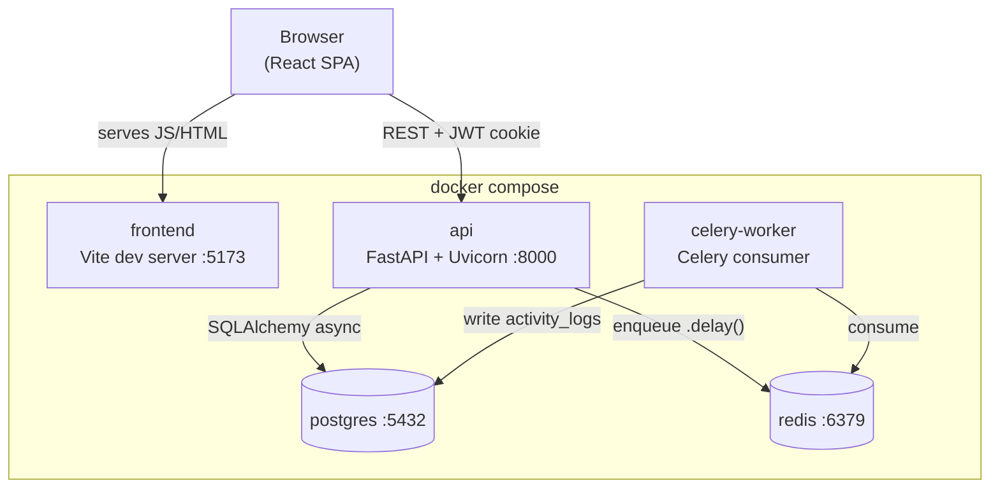

# Task Management App

[](https://github.com/MuriloSergioDev/task-manager-bla/actions/workflows/ci.yml)

A full-stack task management application built as a technical-interview exercise, demonstrating Clean Architecture on the backend, a typed React frontend, JWT authentication, background job processing, and a fully containerized development stack.

## Overview

Users can register, log in, create/view/update/delete tasks, assign tasks to other users, mark tasks complete, filter tasks by status and due date, and paginate results. The full set of user-facing behavior, with acceptance criteria mapped to endpoints and tests, is in [docs/user-stories.md](docs/user-stories.md). The application demonstrates production-quality engineering practices at interview scope: layered backend architecture, comprehensive automated testing (backend unit, integration and API tests; frontend unit tests; browser end-to-end and accessibility tests) run in CI, rate limiting, async background processing, and a responsive typed frontend.

## Architecture



**Request flow:** the browser talks directly to the FastAPI `api` service (not through the Vite server) authenticated by a JWT that `POST /api/v1/auth/login` sets as an `HttpOnly`, `SameSite=Lax` cookie, so frontend JavaScript never sees the token (the SPA calls `GET /api/v1/auth/me` to learn who is signed in). Every protected route resolves the current user through a single `get_current_user` dependency, and authorization (who may edit/delete/complete/assign a task) is centralized in `TaskAuthorizationService` rather than duplicated across route handlers.

**Background flow:** when a task is marked complete, the API commits the status change synchronously, then dispatches `record_task_completed_activity` to Celery. The Celery worker (a separate process, own DB connection) writes an `activity_logs` row recording the event. This is asynchronous because activity logging isn't required for the completion response to succeed — coupling it to the request would add latency and a failure mode to a primary user action for no benefit.

**Backend layering** (`backend/app/`):

```
domain/          entities, repository protocols, and pure business rules
                 (TaskAuthorizationService, TaskStatus) — no framework imports
application/     use cases (one class per operation) + Pydantic request/response schemas
infrastructure/  SQLAlchemy repository implementations, Argon2 hashing, JWT, Celery dispatch
presentation/    FastAPI routes and dependencies — thin, delegate to use cases
workers/         Celery app config and the background task
```

Route handlers never contain business logic: they resolve dependencies, call a use case, and translate domain exceptions to HTTP status codes. This is what lets the domain/application layers be unit-tested with in-memory fakes, with no database or FastAPI involved.

**Frontend layering** (`frontend/src/`): `features/{auth,tasks}` hold feature-specific API calls, TanStack Query hooks, and components; `components/{ui,layout}` hold generic/reusable pieces (the [design system](#design-system)'s component layer, styled only through the tokens in `styles/tokens.css`); `lib/` holds the shared axios client and query client; state that should survive a refresh or be shareable (task filters, pagination) lives in the URL, not React state.

## Technology Choices

| Choice | Why |
|---|---|
| **FastAPI** | Async-native, Pydantic-integrated validation, automatic OpenAPI docs — minimal boilerplate for a typed REST API. |
| **SQLAlchemy 2.x (async) + asyncpg** | Modern typed ORM API; async avoids blocking the event loop under concurrent requests. |
| **PostgreSQL** | Native `ENUM`, `JSONB`, and row-level FK cascade behavior are used directly (task status, activity payloads, owner/assignee cleanup) — features a generic SQL layer would have to emulate. |
| **Alembic** | Standard migration tooling for SQLAlchemy; autogenerate keeps migrations in sync with models. |
| **Argon2** (`argon2-cffi`) | Current OWASP-recommended password hash, memory-hard against GPU cracking. |
| **PyJWT** | Minimal, well-maintained JWT library; access-token-only (no refresh flow) matches the scope actually requested. |
| **Celery + Redis** | Celery is the standard Python task queue; Redis doubles as broker and result backend, avoiding a second infrastructure dependency. |
| **SlowAPI** | Thin FastAPI-native wrapper over a well-tested rate-limiting algorithm; documented in-memory/per-instance limitation below. |
| **React + TypeScript + Vite** | Fast dev server, typed components, no build-config yak-shaving. |
| **TanStack Query** | Server state (tasks, users) doesn't belong in component state — Query handles caching, invalidation, and loading/error states without hand-rolled reducers. |
| **React Router** | Standard SPA routing; used for auth guards and URL-synced filter/pagination state. |
| **Tailwind CSS v4** | Utility classes keep styling co-located with markup. Its CSS-first `@theme` turns the design tokens into utilities (`bg-ink`, `text-label`, `rounded-sheet`), so the design system needs no separate build step. |
| **Storybook** (dev only) | Documents and previews the design system's components in isolation, with an axe accessibility check on every story. Chosen over a hand-built preview page because it's the industry-standard workshop reviewers already know; it's never bundled into the app. |
| **React Hook Form** | Uncontrolled-input form state avoids re-rendering on every keystroke; built-in validation rules cover this app's needs without adding a schema-validation library. |

## Setup

### Docker (recommended — single command)

```bash
cp .env.example .env
cp backend/.env.example backend/.env      # edit JWT_SECRET_KEY for anything beyond local dev
cp frontend/.env.example frontend/.env
docker compose up --build
```

This starts `postgres`, `redis`, `api` (migrated automatically on startup), `celery-worker`, and `frontend`. Once healthy:

- Frontend: http://localhost:5173
- API: http://localhost:8000
- Swagger UI: http://localhost:8000/docs

Seed demo data (see [Demo Credentials](#demo-credentials)):

```bash
docker compose exec api python -m scripts.seed
```

### Local development (without Docker)

Backend:

```bash
cd backend
python -m venv .venv
./.venv/Scripts/activate   # or source .venv/bin/activate on macOS/Linux
uv sync --extra dev        # installs the exact versions in uv.lock into .venv
pre-commit install         # ruff, ruff-format, oxlint and hygiene checks on every commit
cp .env.example .env       # point DATABASE_URL at a local Postgres
alembic upgrade head
uvicorn app.main:app --reload
```

Redis and Postgres still need to run somewhere reachable at the URLs in `.env` — `docker compose up -d postgres redis` is the easiest way to get just those two.

To run the background worker locally: `celery -A app.workers.celery_app worker --loglevel=info` (Windows: add `--pool=solo`).

Frontend:

```bash
cd frontend
npm install
cp .env.example .env
npm run dev
npm run storybook          # design system: http://localhost:6006
```

## Environment Variables

**Root `.env`** (consumed by `docker-compose.yml` for the `postgres` service):

| Variable | Purpose |
|---|---|
| `POSTGRES_DB` / `POSTGRES_USER` / `POSTGRES_PASSWORD` | Database name and credentials, also used to build `DATABASE_URL` for `api`/`celery-worker` in Compose. |

**`backend/.env`**:

| Variable | Purpose |
|---|---|
| `DATABASE_URL` | Async SQLAlchemy connection string (`postgresql+asyncpg://...`). |
| `JWT_SECRET_KEY` | Signs/verifies access tokens. **Must** be changed for anything beyond local dev. |
| `JWT_ALGORITHM` | Defaults to `HS256`. |
| `ACCESS_TOKEN_EXPIRE_MINUTES` | Access token lifetime (default 30). |
| `REDIS_URL` / `CELERY_BROKER_URL` / `CELERY_RESULT_BACKEND` | Redis connection (broker + result backend). |
| `CORS_ORIGINS` | Comma-separated list of allowed frontend origins. |

**`frontend/.env`**:

| Variable | Purpose |
|---|---|
| `VITE_API_BASE_URL` | Base URL the browser calls for the API (not resolved inside Docker's network — the browser hits it directly). |

Required configuration is validated at startup (missing `DATABASE_URL`/`JWT_SECRET_KEY` fails immediately via Pydantic Settings, not on first use).

## Database

**Migrations:** Alembic, autogenerated from the SQLAlchemy models in `app/infrastructure/database/models.py`.

```bash
# Docker
docker compose exec api alembic upgrade head
docker compose exec api alembic revision --autogenerate -m "description"

# Local
cd backend && alembic upgrade head
```

The `api` and `celery-worker` containers both run `alembic upgrade head` on startup (via `entrypoint.sh`) before starting their actual process, so a fresh `docker compose up --build` always ends up migrated — no manual step required.

**Seeding:**

```bash
docker compose exec api python -m scripts.seed
# or locally: python -m scripts.seed  (from backend/, with DATABASE_URL set)
```

The seed script is idempotent — it checks whether `alice@example.com` already exists and skips entirely if so.

## Running Tests

Backend:

```bash
cd backend
pytest                              # full suite (unit + integration)
pytest tests/unit                   # unit tests only — no database needed
pytest tests/integration            # integration/API tests — needs Postgres reachable
```

Integration tests run against a **real** Postgres database (the schema uses native `ENUM`/`JSONB`/UUID types that SQLite doesn't faithfully emulate) via a dedicated `taskdb_test` database, wrapped in a per-test transaction that's always rolled back — tests never see each other's data, and nothing they write persists.

`taskdb_test` is created automatically the first time `postgres`'s volume initializes (via `postgres-init/01-create-test-db.sh`), so `docker compose up` alone is enough. Running Postgres outside Docker instead? Create it yourself: `createdb -U <user> taskdb_test`, then `DATABASE_URL=postgresql+asyncpg://.../taskdb_test alembic upgrade head` to migrate it.

Frontend (from `frontend/`; run `npm install` and `npx playwright install chromium` once). On Linux, run `npm install` **before** the first `docker compose up`. Otherwise Docker creates `frontend/node_modules` as root (it's the mount point for the container's own `node_modules` volume), and a later `npm install` on the host fails with `EACCES`.

```bash
npm run lint                        # oxlint, fails on warnings
npm test                            # Vitest unit tests (npm run test:coverage for coverage)
npm run build                       # strict TypeScript (app, node and e2e configs) + production build
npm run build-storybook && npm run test:storybook   # axe + console errors on every component story
npm run test:e2e                    # Playwright against the running, seeded stack: main flows + axe on every screen
```

The frontend has four layers:
- **Unit tests (Vitest):** logic and forms. They run with the timezone pinned to UTC-3, so "is this overdue?" can't silently fall back to the UTC date.
- **Storybook checks:** accessibility and console errors on every component.
- **End-to-end tests:** the main flows against the real stack.
- **Visual diff:** on demand, for refactors.

`test:e2e` runs at desktop and mobile widths and signs in once per run, because login is rate-limited. For refactors that shouldn't change the UI, `npm run test:visual:baseline` before and `npm run test:visual` after compare every screen pixel by pixel.

**CI** ([`.github/workflows/ci.yml`](.github/workflows/ci.yml)) runs all of this on every push and pull request: the backend suite against Postgres, frontend lint, unit tests, build and Storybook accessibility, and the e2e suite against a freshly built and seeded `docker compose` stack. The e2e job uses the same setup steps as [Setup](#setup) above.

## Coverage

```bash
cd backend
pytest --cov=app --cov-report=term-missing
```

Gate: 80% (configured in `pyproject.toml`); actual coverage is in the high 90s. Note: `[tool.coverage.run] concurrency = ["greenlet", "thread"]` is required — without it, coverage.py reports false "uncovered" lines for code that runs after an `await` crossing a greenlet boundary (SQLAlchemy's async-to-sync bridge) or inside FastAPI's threaded sync dependencies.

## API Documentation

Interactive Swagger UI: **http://localhost:8000/docs** (also `/redoc`). Generated from the FastAPI route definitions and Pydantic schemas — always in sync with the actual API, documents request/response shapes, query parameters, and error responses. Auth is cookie-based, so there's no "Authorize" button: run `POST /api/v1/auth/login` with "Try it out" (e.g. the [demo credentials](#demo-credentials)) and the browser keeps the cookie for the protected endpoints that follow.

## Design System

The frontend has a small, home-made design system (no component library):

- **Tokens:** `frontend/src/styles/tokens.css` is the only place visual values are defined (colour, type scale, radius, widths, elevation, motion). Tailwind turns them into utilities, and components never use one-off values like `text-[13px]`.
- **Components:** `frontend/src/components/ui` (`Button`, `Input`, `Select`, `Textarea`, `Modal`, `ConfirmDialog`, `Alert`, `EmptyState`, `Pagination`, `StatusBadge`, `Spinner`), imported from one index.
- **Storybook:** `cd frontend && npm run storybook` → http://localhost:6006. It has a live **Foundations** page generated from `tokens.css`, stories for every component and state, and the axe accessibility panel. `npm run build-storybook` produces a static copy.

Rules, naming and how to add a token or component: [docs/design-system.md](docs/design-system.md).

## Demo Credentials

Seeded by `python -m scripts.seed` (see [Database](#database)):

| Email | Password |
|---|---|
| `alice@example.com` | `DemoPass123!` |
| `bob@example.com` | `DemoPass123!` |
| `carol@example.com` | `DemoPass123!` |

Seed data includes 7 hand-written tasks plus a deterministic backlog of 30 generated ones owned by alice — every combination of status × assignee (unassigned/bob/carol), due dates in the past, future, and none (several overdue), and some already completed. Alice sees 35 tasks, so her list spans two pages at the dashboard's page size of 20 and pagination is demonstrable immediately after seeding.

These are local-development-only credentials for a project with no real users. Never reuse this pattern for a real deployment.

## Design Decisions

**Authorization model.** Tasks are **private to the people involved**: a user can only see tasks they own or are assigned to. This is enforced on the server — `ListTasksUseCase` always scopes the query to the current user (it's not a client-supplied filter, so no route can forget or widen it), and every single-task use case loads through `get_visible_task`. A task you can't see returns **`404`, not `403`**, identical to a nonexistent id, so task ids can't be probed to learn what exists; `403` is reserved for users who *can* see a task but lack a specific permission (an assignee trying to reassign). An earlier version let any authenticated user read every task via the API while the UI hid them client-side — writing the user stories exposed that mismatch (see [docs/ai-development.md](docs/ai-development.md)). The **owner or current assignee** may update or complete a task; only the **owner** may delete it or reassign it — both are record-level decisions (deleting removes the task for the owner too), not part of doing the work. Completing goes only through `POST /tasks/{id}/complete`, which stamps `completed_at` and enqueues the activity job; a `PATCH` to `COMPLETED` is rejected with `422`, and an explicit `null` for `title` or `status` is rejected too. This required adding an `owner_id` column distinct from `assigned_to`: ownership and assignment are different concerns, and collapsing them would either let a stranger manipulate a task they have no relationship to, or block the person actually doing the work from managing it.

**Dashboard: paginated list, not a board.** Tasks are shown as a server-paginated list (20 per page, Previous/Next, showing the range, e.g. "21–35 of 35"), with page and filters in the URL. An earlier drag-and-drop Kanban board was replaced: a board wants every task at once, which meant fetching one 100-item page and bucketing client-side — incompatible with real pagination and with accurate totals. The list shows one grid row per task on desktop and stacks into cards on mobile. Status changes go through the edit form (To do / In progress, or reopening a completed task — the backend clears `completed_at` when status moves away from `COMPLETED`), while completing uses the dedicated **Complete** action, because `POST /tasks/{id}/complete` is what stamps `completed_at` and enqueues the activity job. Reassignment stays owner-only; non-owners see the assignee as read-only text. The UI hides actions the user can't perform, but the API remains the actual authority.

**No refresh tokens.** A single short-lived (30 min default) access token; on expiry, the frontend redirects to login. Refresh-token rotation is real complexity (secure storage, revocation, rotation-on-use) that wasn't asked for.

**Access token lives in an httpOnly cookie, not localStorage.** `POST /api/v1/auth/login` sets the JWT as an `HttpOnly`, `SameSite=Lax` cookie (`Secure` outside `development`) rather than returning it in the response body; the frontend never has a JS-readable copy of the token, closing off token theft via XSS. The tradeoff is CSRF exposure, mitigated two ways: `SameSite=Lax` already excludes the cookie from cross-site `POST`/`PATCH`/`DELETE` requests (the mutating endpoints), and CORS is pinned to an explicit origin allowlist rather than `*`. This is deliberately short of a double-submit CSRF token — `SameSite=Lax` plus a strict CORS origin list covers the realistic browser attack surface for this app's scope, and a full CSRF-token scheme would be complexity without a matching threat here. Because the token is no longer client-readable, the frontend can't decode it locally to learn who's logged in; `GET /api/v1/auth/me` exists for that (session bootstrap on page load) and `POST /api/v1/auth/logout` clears the cookie server-side.

**Self-registration exists, but isn't the primary path.** `POST /api/v1/auth/register` is a real, tested endpoint, but the demo credentials above (via the seed script) are the intended way to explore the app with realistic data already in place.

**Known trade-offs from the tech-lead review.** Repositories commit their own writes, so a use case can't group several writes into one transaction; no use case needs that yet. The activity event is enqueued after the commit, so if Redis is down it is lost: the dispatcher logs it and the request still succeeds, but `.delay()` is a blocking call inside an async handler and waits on Celery's publish retries (about 20s measured with Redis stopped). The proper fix is a transactional outbox, or at least a fail-fast publish policy. `GET /api/v1/users` is a team directory for the assignee picker and returns only `id` and `email`; with open registration, anyone who signs up can read it. Docker Compose here is a development setup (bind mounts, `--reload`, Vite dev server, containers run as root), not a production image.

**Rate limiting is in-memory and per-instance.** SlowAPI's default storage is per-process. Running multiple `api` replicas behind a load balancer means each replica enforces its own 100/min (general) or 5/min (login/register) quota independently — a client could get up to `N × limit` requests across `N` replicas before being universally blocked. A production multi-instance deployment would need a shared store (Redis-backed limiter) for a single global quota.

**Database testing strategy.** Unit tests (`tests/unit/`) use in-memory fake repositories — no database, no network, fast. Integration/API tests (`tests/integration/`) run against real Postgres in a per-test rolled-back transaction. This was a deliberate rejection of SQLite-for-speed: the schema leans on Postgres-specific behavior (native `ENUM`, `JSONB`, FK cascade semantics for owner/assignee cleanup) that a different engine would either reject or silently emulate differently, which would validate the wrong thing.

**Task filtering and pagination.** `GET /api/v1/tasks` combines `status`, `due_date`, `due_date_from`/`due_date_to`, and pagination via AND semantics. An invalid range (`due_date_from` after `due_date_to`) is rejected with `422` before touching the database. Page size is capped at 100 to prevent an unbounded response.

**Background task error handling.** `record_task_completed_activity` retries up to 3 times with a fixed 10s backoff on failure; if retries are exhausted, the error is logged and swallowed rather than raised — this is documented as a non-critical operation, so a logging failure must never surface to the user or be retried by the client.

## AI-Assisted Development

**Tool.** Claude Code (Anthropic) was the implementation agent across all nine phases of the [specification](docs/specification.md)'s workflow — architecture proposal through final review — not a one-off autocomplete or a single "generate the app" prompt.

**How the repository is set up for AI-assisted work.** Three pieces:
- [`CLAUDE.md`](CLAUDE.md): the agent's short, current instructions. It covers the architecture rules, and environment gotchas learned the hard way (the login rate limit, the dev tools living in the venv rather than the API container, the Vite bind mount).
- Two project skills in [`.claude/skills/`](.claude/skills/): `/validate` runs the full validation pass in order and reports it honestly, and `/log-ai-decision` keeps [docs/ai-development.md](docs/ai-development.md) consistent and truthful.
- CI, as the check that doesn't depend on the agent at all.

Custom subagents, hooks and MCP servers were deliberately left out. The reasons are in [§12 of the log](docs/ai-development.md#12-harness-how-the-repo-is-set-up-for-ai-assisted-work).

**How prompts were structured.** Each phase was driven by the corresponding section of the [specification](docs/specification.md) plus the accumulated context of prior phases (existing schema, existing use-case patterns, existing test fixtures), so later code stayed consistent with earlier decisions rather than reinventing patterns per file. Where the spec was genuinely ambiguous (see "Design Decisions" above), the ambiguity was surfaced as an explicit question before writing code, not resolved by guessing silently.

**How generated code was validated.** Every phase ended with the same gate before moving on: the full test suite, `ruff check` + `ruff format --check`, `mypy --strict` (backend) or `tsc --noEmit` + `oxlint` (frontend) — and, critically, a live smoke test against the real stack (a running `uvicorn`/Celery worker/Postgres/Redis, or a real headless browser via Playwright), not just green checkmarks from static tools. Phase 9's final review went a step further and tore the whole stack down to a genuinely empty volume (`docker compose down -v`) rather than reusing containers that had been running since Phase 6 — which is what it took to surface a real migration race (below). These checks now run on every push in CI (see [Running Tests](#running-tests)). A few examples of what a live pass caught that static checks and re-used containers didn't:

- The Celery background task reused the app's pooled async database engine. Unit tests (which use a fake dispatcher) never touch it, so this passed every unit test — but failed the first time the task actually ran, in its own integration test, because `asyncio.run()` tears down its event loop on every call and a pooled asyncpg connection can't survive across loops.
- `TaskFormModal` rendered inside each table row's fragment, landing as a direct child of `<tbody>` — invalid HTML that browsers silently "fix" visually, so `tsc` and a lint pass both stayed clean. A real headless-Chromium pass (Playwright) surfaced the React hydration warning in the console.
- Both `api` and `celery-worker` ran migrations on startup, documented at the time as "harmless." That was true against the already-migrated volume every phase since Phase 6 had been reusing — but a truly fresh `docker compose up --build` had both containers race on creating Alembic's own version-tracking table, and one lost. Only `down -v` followed by a real cold start reproduced it.

**What AI-generated code was changed.** Each item below was generated or planned by the AI, then corrected once review or validation showed it was wrong:
- a literal reading of the spec's authorization rules ([§1](docs/ai-development.md#1-architecture-resolving-the-ownershipassignment-ambiguity));
- a Celery task that reused the web app's connection pool across event loops (§5a);
- migrations running in two containers at once (§6);
- permanent database errors being retried like transient ones (§7);
- task visibility enforced only in the UI while the API returned everything (§9c);
- an "overdue" check that used the UTC date (§9d);
- text colours that failed WCAG contrast (§9e);
- a global 401 handler that made `/register` unreachable by URL, and a TypeScript config that never enabled `strict` (§9f).
- URL filters passed to the API unchecked, so a stale link broke the dashboard (§9g, found by writing the frontend unit tests first).

Each entry in the log records what was rejected as well as what was accepted.

**How edge cases were handled.** Inactive users, expired/malformed/wrong-secret tokens, duplicate-email registration, unknown assignees, tasks with no due date under a range filter, pagination past the last page, and rate-limit exhaustion are each an explicit test case (see `backend/tests/`), not just the happy path. A Phase 9 pass added two more found by deliberately trying to break things rather than just re-confirming the golden path: completing a task and immediately deleting it races the async activity-log write against the delete (a permanent `IntegrityError`, now failed fast instead of retried three times), and a stale/expired token left in `localStorage` from a previous session now failed auth immediately on load instead of flashing the dashboard first (this applied when the access token was still stored in `localStorage`; it has since moved to an httpOnly cookie — see "Design Decisions" — which sidesteps the client-side staleness check entirely by never giving the frontend a token to read). On the frontend, loading/empty/error states are handled explicitly per screen (not just the "data arrived" case), and the dashboard's task list stacks each row into a card on narrow viewports rather than squishing columns or letting the page body scroll sideways.

**How security was reviewed:** covered in the [Security review highlights](docs/ai-development.md#10-security-review-highlights) section of the AI development log — password hashing, no-hash-in-response, startup secret validation, server-side assignee validation, rate-limit tiers, a live SQL-injection attempt against a filter parameter, and an unbounded login-password field found and fixed during the Phase 9 pass.

**How performance was evaluated:** covered in the [Performance review highlights](docs/ai-development.md#11-performance-review-highlights) section — index placement, mandatory pagination, count-query shape, and why `EXPLAIN`-based assertions were deliberately not added to the test suite.

The full log of what was accepted, rejected, and why — spanning architecture, authentication, testing, error handling, performance, security, and frontend implementation — is in **[docs/ai-development.md](docs/ai-development.md)**.
